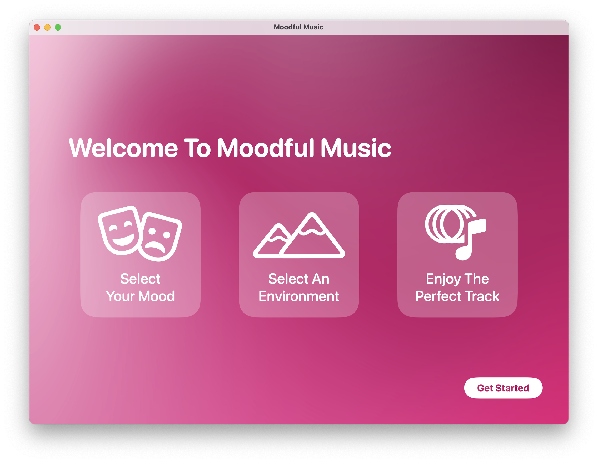
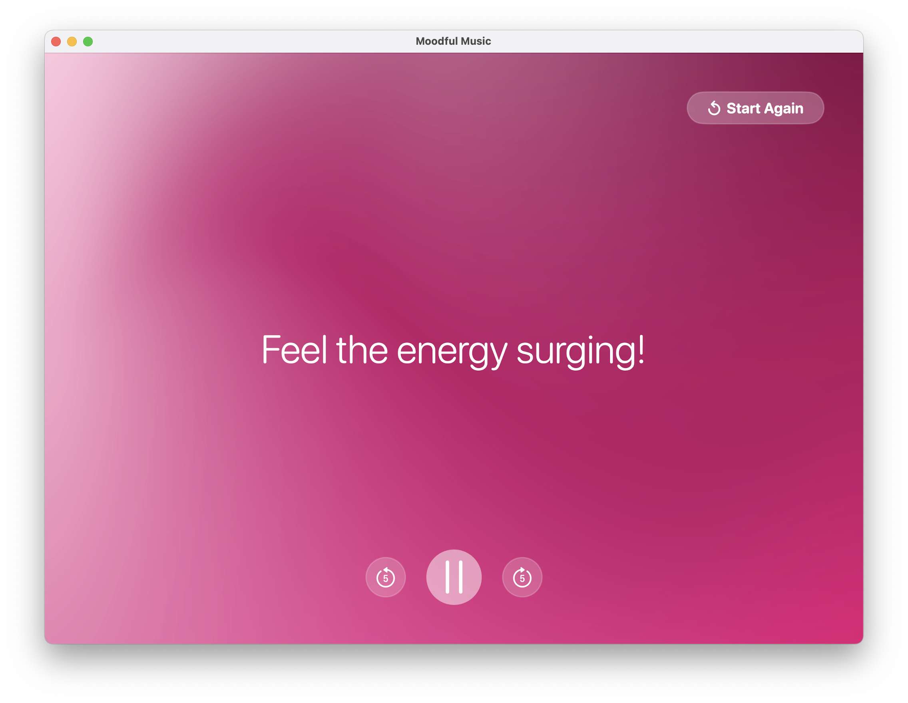
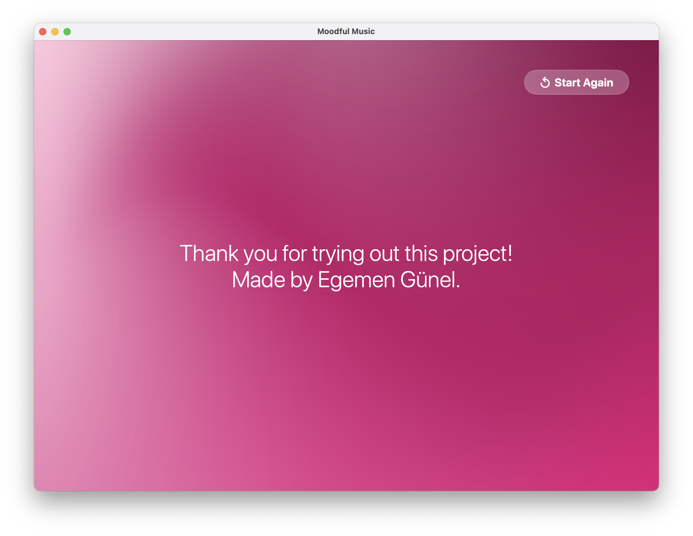

# 🎵 Moodful Music

**A mood-aware music experience powered by SwiftUI and Core ML.**  
Originally built for the **Swift Student Challenge 2025** — now open source for everyone to explore and build upon.

---

## 🌟 Overview

**Moodful Music** is a lightweight, interactive macOS app that lets you choose your **current mood** and **surrounding environment**, then serves you a personalized track suggestion that fits your emotional vibe.

🧠 Behind the scenes, it uses a **Core ML text classification model** to match your input to music moods and environments — creating a more *mindful* and tailored experience.

---

## 🧠 Features

- 💬 **Mood Detection** — Choose how you feel (e.g., Energetic, Calm, Sad…)
- 🌄 **Environment Selection** — Pick where you are (e.g., Garden, Rain, Mountains…)
- 🤖 **Core ML-Powered Matching** — Uses a trained text classifier to analyze mood + environment and suggest the perfect track
- 🎶 **Audio Playback** — Built-in music player with simple UI
- 💖 **Clean SwiftUI design** — Modern, aesthetic, minimal interface

---

## 📸 Screenshots

| Welcome | Mood Selection | Environment | Playback | Credits |
|--------|----------------|-------------|----------|---------|
|  |  |  |  |  |

---

## 🛠️ Built With

**SwiftUI**
**Core ML**
**Create ML**
**AVFoundation** 

---
**Made with ❤️ by Egemen**
